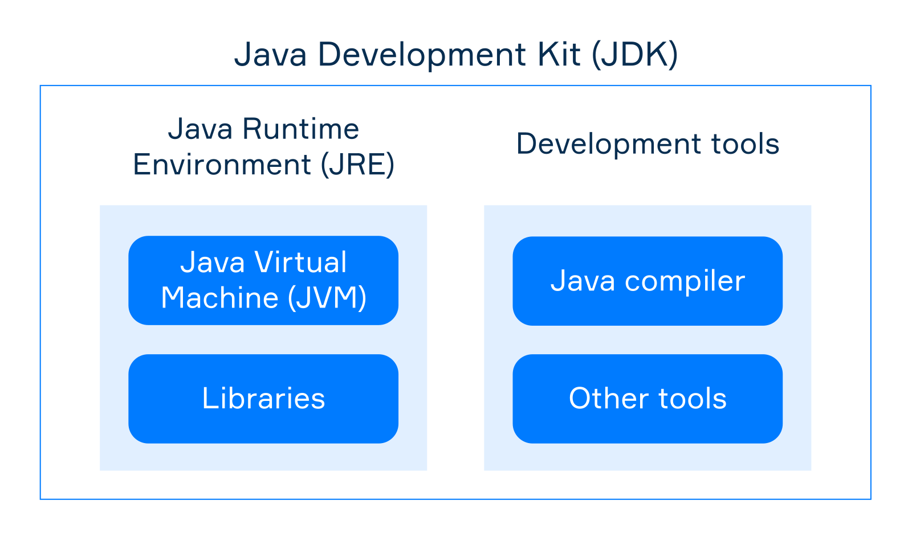
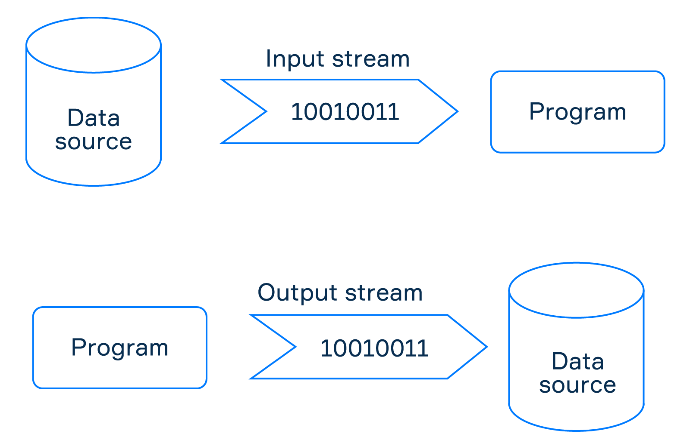

# Notes

### Managing Versions

Use [SDKMAN](https://sdkman.io/install). You can download java (and other tools) versions directly from it, or add already downloaded versions into SDKMAN. You can set default, and local versions using terminal.

To set java version of project inside vscode type `Java: Configure Runtime` command in command palette.

### Exceptions

1. Checked exception - checked (known) by compiler. Compiler force you to write `try..catch` because exception can be thrown. They exclude `RuntimeException` and all its subclassess.
1. Unchecked exception - represented by `RuntimeException`. TRICK! `Exception` is checked exception, even though its subclass is unchecked.
1. If you throw unchecked exception the keyword `throws` is not required in the method declaration
1. The common practice is to throw an exception when and only when the method preconditions are broken, that is when it cannot be performed under the current conditions. So you can throw `InvalidArgumentException` or `FileNotFoundException`.

### Casting

1. Downcasting - narrowing, can be done using `instanceof` on superclass reference.
1. Upcasting - wideing, assigning subclass instance to superclass reference.

### Polymorphism

1. `private` method cannot be overridden so that's the way to persist superclass method from overridding. You'll have both super and sub method, because no overridding happened.
1. You can't have two methods with same name and same parameters in one class, even though if one is `static` and second is not.
1. To access superclass methods and variables use `super`. Calling `super()` is like calling constructor e.g. `new Animal()`.
1. When you have `method1()` in superclass that calls `method2()` and you'll overwrite `method2()` in subclass, then when you call `method1()` it will use subclass `method2()` because of overridding.
1. `@Override` annotation is not mandatory, but considered a good practice.
1. `static` methods cannot be overridden, but can be hidden when subclass implements same-named and same-parametrized method.

### JVM, JRE, JDK

1. **Java Virtual Machine** executes compiled bytecode.
1. **Java Runtime Environment** includes JVM and standard libraries and runs compiled programs.
1. **Java Development Kit**, which includes JRE and development tools, is used by developers to write programs.

### Functional

1. By lambda expression (or just "lambda"), we mean a function that isn't bound to its name (an anonymous function) but can be assigned to a variable.
1. Lambdas have colosures [link](https://hyperskill.org/learn/step/11635#closures).
1. **Higher-Order Function** is a function that accepts or returns another function.

### Files

1. `File` class. The code will work even if a file or a directory does not actually exist in your file system. It does not create a new file or directory. It just represents "a virtual" file or directory that exists already or may be created in the future.
1. `FileWriter` and `PrintWriter` both extend the Writer abstract class and have many similarities. However, `PrintWriter` is more of a high-level one and provides several useful methods. Among them are formatting methods and overloaded print methods for writing primitive types.
1. You can pass `FileWriter` (upcasted to `Writer`?) to `PrintWriter` because you know, `PrintWriter` extends `Writer` doesn't it?

### [Streams](https://hyperskill.org/learn/step/5533)

###### In/Out

1. Input stream, which reads data from a source,
1. Output stream, which writes data to a specified destination.

###### Char/Byte

1. Char streams that are used to read and write data in characters according to the 16-bit Unicode format. They often end with `Reader`/`Writer`.
1. Byte streams that are used to read and write data in bytes. They often end with `InputStream`/`OutputStream`.

<!-- -->

1. When you create an empty array it is actually filled with default values, which are '\u0000' for a char array. The tricky thing here is that '\u0000' is interpreted as an empty symbol and not displayed at all, although technically it is present. Remember that when you read data into an array.
1. Char streams make processing text data much easier for programmers. In comparison with them, byte streams are quite low-level but can work with data of any type including multimedia.

### Synchronization

1. **Synchronous** - one task at a time, the next starts when the previous is done.
1. **Asynchronous** - multiple tasks at the same time in overlapping periods, executing by little parts.
1. **Parallel** - multiple or one task split into parts being executed continuously by different executors in parallel.
1. Concurrent tasks that compete only for executor's time and don't require a lot of resources to be completed can run concurrently inside the same thread. These tasks are called lightweight, and this type of concurrency is called an internal or lightweight one. The execution inside threads can be synchronous or asynchronous but never parallel.
1. A **daemon thread** (comes from UNIX terminology) is a low priority thread that runs in the background to perform tasks such as garbage collection and so on. JVM does not wait for daemon threads before exiting while it waits for non-daemon threads.
1. If you call `run()` directly on thread instance, it will just run the code, but ON YOUR CURRENT THREAD!!!

### Other

1. Interface is a class and can have:
   - instance methods declarations (they are `abstract` by default),
   - public constants,
   - `default`, `private` and `static` methods implementations.
1. `Object` class is a most generic type, everything can be assigned to it. It was used before `Java 5` before introduction of generics.
1. Don't prefix interfaces with `I` instead postfix concrete classess with `Impl` when necessary.

### Questionable

1. Maybe adding generic `catch(Exception e)` at the end of `try..catch` statement is a good idea?
